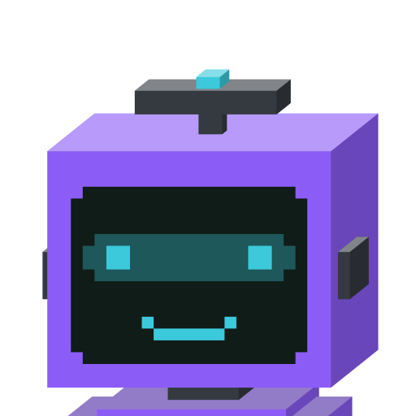

  

  <h1>Eidon for Unraid</h1>

  <a href="https://eidonai.app"><b>eidonai.app</b></a>

  

    <a href="https://github.com/Quack6765/Eidon-AI"><b>Eidon</b></a>,
    a self-hosted AI platform with a team of agents, and a chat for everything else,
    is available in Unraid Community Applications.
  

> [!NOTE]
> This repository only holds the Unraid template. Eidon itself, its documentation and its issue
> tracker live in the main repository: **[Quack6765/Eidon-AI](https://github.com/Quack6765/Eidon-AI)**.

## Install

1. In Unraid, open the **Apps** tab and search for **Eidon**.
2. Click **Install** and fill in the fields:
   - **Base URL**: the address you will open Eidon at, for example `http://192.168.1.10:3000`.
   - **Admin username** and **Admin password**: your first administrator account.
   - **Session secret** and **Encryption secret**: generate each one in the Unraid terminal with
     `openssl rand -hex 32`. Keep a copy of the encryption secret: restoring a backup needs the same
     value.
3. Click **Apply**, then open the WebUI, sign in, go to **Settings → Providers**, add a model key,
   and start chatting.

Your data lives in `/mnt/user/appdata/eidon`. Back up that folder to back up Eidon.

## Support

- Problems with Eidon itself: [open an issue in the main repository](https://github.com/Quack6765/Eidon-AI/issues).
- Problems with the template (a wrong default, a missing field): open an issue or a pull request here.

Configuration, providers and backups are covered in the
[Eidon documentation](https://github.com/Quack6765/Eidon-AI#-documentation).

## Contributing

Pull requests are welcome. The maintainer reviews and merges every change.

## License

The template in this repository is released under the [MIT License](./LICENSE). Eidon itself is
licensed under [AGPL-3.0](https://github.com/Quack6765/Eidon-AI/blob/main/LICENSE).
